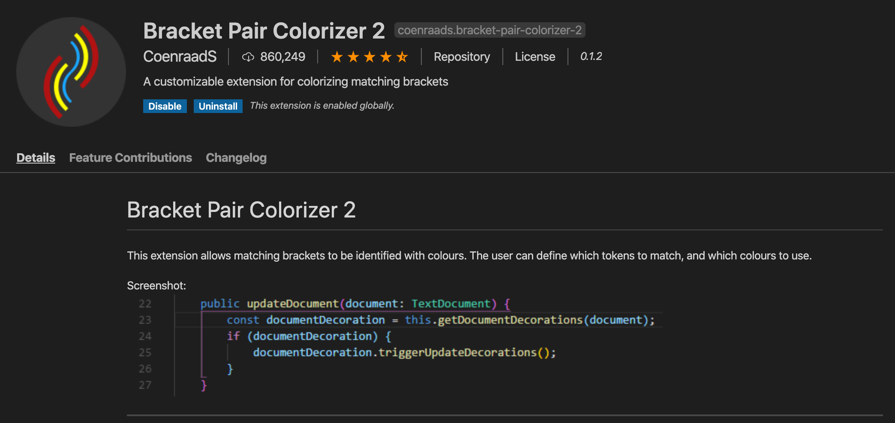

# My VS Code Setup for Python

## 1. Bracket Pair Colorizer 2

This is perhaps one of my favorite extension to use in VS Code. This can be used with any language, it's not that it's mainly for Python users. If I remember correctly, JS users were it's main target. But heck, that doesn't mean we can't use it. Just search for "Bracket Pair Colorizer 2" on the Extension tab in VS Code.

