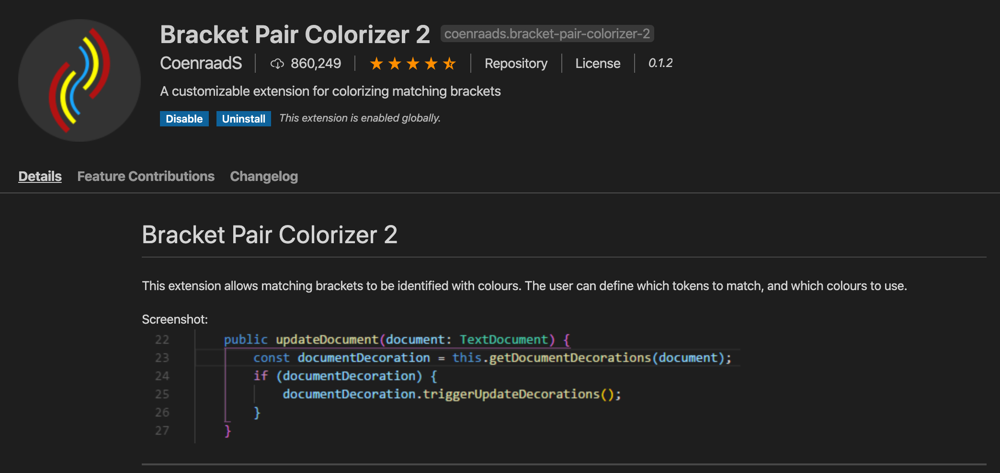
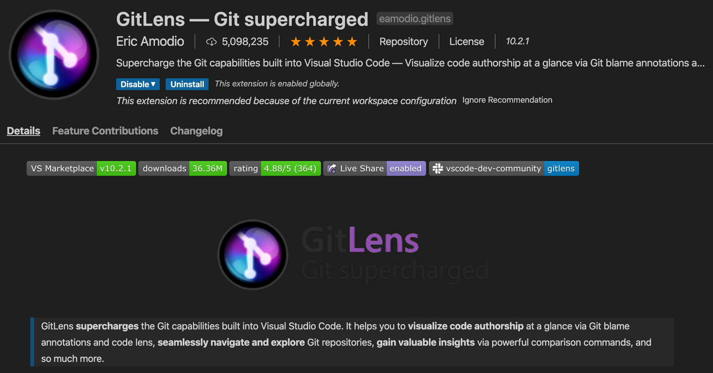
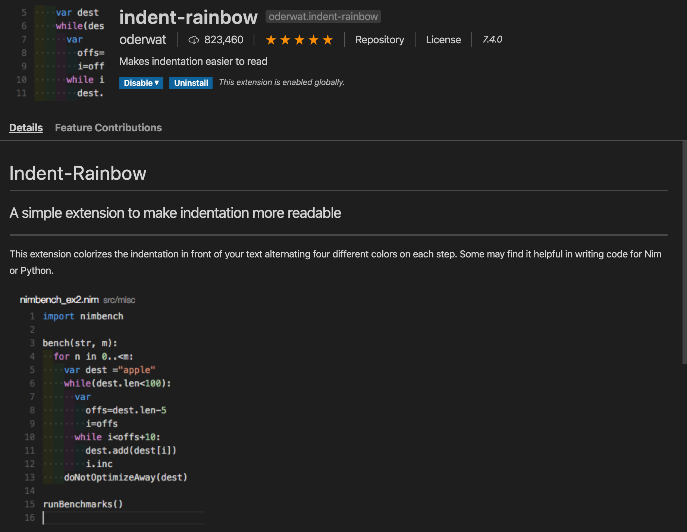
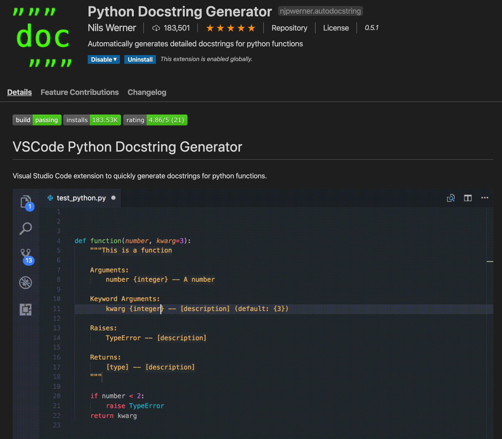
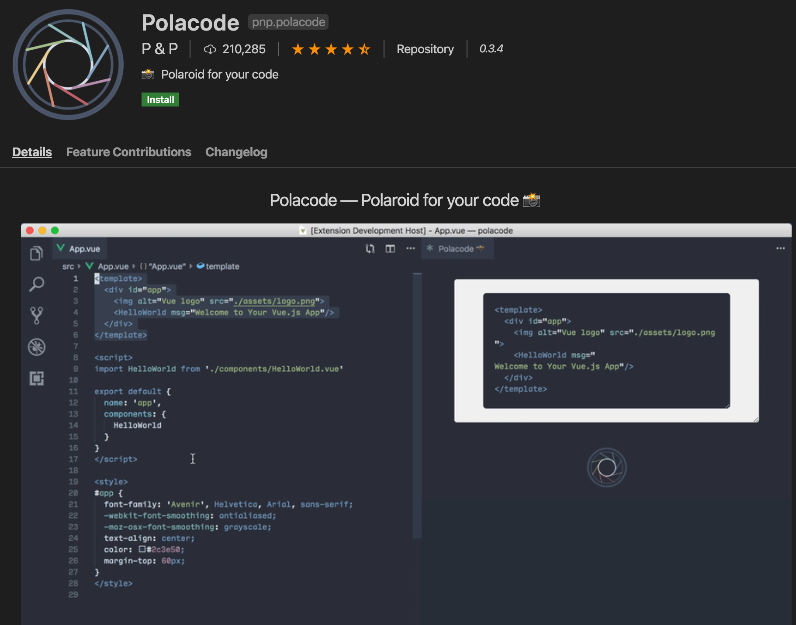
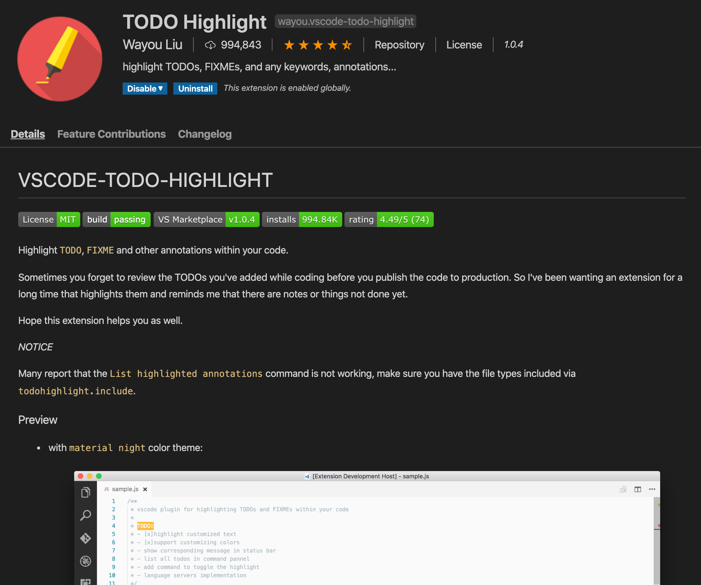

# Best VS Code Extensions for Python

_It is assumed Python extension for VS code is already installed_

## 1. Bracket Pair Colorizer 2

This is perhaps one of my favorite extension to use in VS Code. This can be used with any language, it's not that it's mainly for Python users. If I remember correctly, JS users were it's main target. But heck, that doesn't mean we can't use it. Just search for "Bracket Pair Colorizer 2" on the Extension tab in VS Code.

## 2. GitLens

This is perhaps one of my favorite Git extensions for VS Code. I use it all the time. It not only shows me when I committed what but also who changed and when. Really awesome when doing collaboration. Also keeps tracks of tracked, untracked, modified files. Visually appealing as well. Merge, Push, Pull, Commit, Stash etc everything in one place if you don't fancy using the _Terminal_.Search Extension tab in VS Code for "GitLens" and you should definitely find it.

_**10 out of 10. Would Recommend**_

## 3. indent-rainbow

This is perhaps one of my favorite extensions for Python. It shows you the indentation in different colors. Very handy.

## 4. Python Docstring Generator

Documenting your code is something that's really important. A lesson that I learned during my internship :D Python Docstring Generator automatically genereates Docstring for any methods and can cycle through the keywords/parameters/argument with the press of _Tab_ button. Very handy and nifty if you are lazy writing proper doc.

## 5. Polacode

Want to share beautiful screenshot of your code snippet to someone? Fear not. Polacode is here to the rescue. It captures your code snippet like an image taken by a Polaroid Camera.

## 6. TODO Highlight

This is one of my most used extension of all time. The feature that I use most is **FIXME** and **TODO** which automatically highlights in the editor about what needs to be fixed in the code and what needs to be done later. You can also search by your _FIXME_ and _TODO_ tags to quickly find the things that needed to be done.

## 7. Markdown Preview Enhanced

Working with GitBook, this has become one of my favorite extension as it allows me to see the rendered Markdown file in real time. Very handy for writing `MD or Markdown` file for Github.

## 8. Material Theme

The extension name speaks for itself. This is one of the best theme extension pack for VS Code. I usually use _Material Theme Ocean_ as I like Dark themes. Type `CMD+Shift+P` on Mac or `CTRL+SHIFT+P` on Windows and search for Color Theme.

## 9. Material Icon Theme

To complement Material Theme, Material Icon Theme is a great addition. The icons are more catchy and vibrant than the default icons shipped with VS Code. You'll not be disappointed.

## 10. Code Spell Checker

Need a word like spell checker? Code Spell Checker is here to rescue. It will automatically highlight misspelled words.

## 11. Jinja2 Snippet Kit
Very handy if you use Jinja templates. I mainly use it with Flask based websites and sometimes for API creations. This provides some very handy shortcuts. A must for Flask framework users.

## 12. Prettier - Code formatter
I have started to use Prettier fairly recently after getting to know about this extension. But this is mainly used by web devs but I use it for formatting JSON strings and files. Very handy especially when you work with JSON or YAML files. And working with cloud, YAML is a must nowadays. Although seems like for AWS, they still heavily use JSON files instead of YAML. I really like the fact that in GCP, YAML is heavily used if I am not mistaken.

> I will update frequently when I find any new Extension

