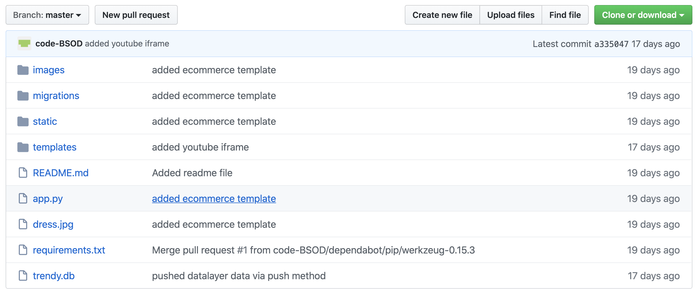

# Deploying Flask Web App for GA & GTM on Google App Engine

## Deploying Flask Web App for GA & GTM on Google App Engine

> If only need to know about the deployment, checkout the video.

### Context

**R**ecently I have started to work with _Google Analytics_ \(GA\) and _Google Tag Manager_ \(GTM\) for work related purposes and have been enjoying it quite a lot. I feel like now I have a better understanding about how website datas are coming or being generated and how to actually analyze those data for data science and machine learning purposes.

**B**ut a **big** challenge that I have faced learning GTM is the lack of hands-on resources. They say they are hands-on and yet, they don't provide you a working website where you can actually implement GTM and play around.

**T**hus to overcome the issue, I created my own Flask based web app to get hands-on learning experience. This article won't be about GA or GTM but rather how I deployed my web app in Google App Engine \(will be referred as GAE further on\) for testing purposes. Probably will do a separate section for GA & GTM later.

### Google App Engine \(GAE\)


**So what's GAE, I hear you asking?**

GAE is a **fully serverless managed platform** from Google Cloud Platform \(GCP\) where the infrastructure management is handled by Google and us, developers can just focus on `Code` rather than thinking about Ops or Operation side. **Autoscaling** is perhaps my favorite feature of GAE. The **Security** part of your app is also taken care by App Engine.

> Some of the coolest and notable features are:
>
> * Support for many languages \(Python, Java, Go etc\)
> * App Version Control \(Automatically creates version for every deployment\)
> * Easy Traffic Routing for A/B testing
> * Managed SSL/TLS certifications for **free** with Firewall rules.
> * Auto Scaling based on load.
> * Generous **FREE QUOTA** usage.

To learn more: [App Engine \| Google Cloud](https://cloud.google.com/appengine)

**Why did I choose GAE instead of standalone VM/Server?**

I have been using GAE for quite sometime now, mostly for fun as they give generous free usage quota. So anytime I created any web app, even for fun, I deployed it in GAE. And for sometime, I have been testing APIs on GAE as well. I found testing APIs on GAE is quite useful \(although Google prefers using `Cloud Endpoint`\).

And also provisioning a VM, even **G1-Small** instances will incur charges if you're using `Static IP` instead of `Ephemeral IP`. And since ephemeral IP addresses are temporary, it will change overtime or when you turn on/off the instances whereas GAE will provide you a static web address that will always be running.

#### TL;DR

Let's just go to deployment.

**Step 1**: Create the app. Git clone it in your Google Cloud Shell. Navigate to the folder.

The Flask web app looks something like this.

 

**Step 2**:

> Must rename app.py to main.py

* Create a `app.yaml` configuration file for GAE in the same folder where your codes are. It looks something like this.

```text
runtime: python37

handlers:
  # This configures Google App Engine to serve the files in the app's static
  # directory.
- url: /static
  static_dir: static
- url: /photos
  static_dir: photos
- url: /imgs
  static_dir: static/imgs
  # This handler routes all requests not caught above to your main app. It is
  # required when static routes are defined, but can be omitted (along with
  # the entire handlers section) when there are no static files defined.
- url: /.*
  script: auto
- url: .*
  script: auto
```

**Step 3**: Deploy in GAE 

a. In Cloud Shell, run CMD, `gcloud app deploy` 

b. You'll be asked to select the region \(in my case, since I've already deployed previously, it's asking me if it should keep the current configuration\)

**Step 4**: Check the deployed app Now the app should have automatically been deployed in App Engine. _To check the app your browser, run the CMD:_ `gcloud app browse` And it should return a link to the web app.

**And we've deployed our Flask Web App successfully on Google App Engine.**


#### Check the video for some more information

