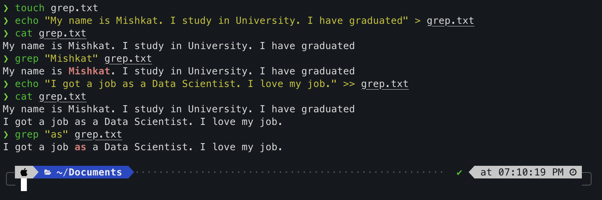

# My Most Used Terminal Commands

> By default, Ubuntu uses bash and Mac, although has bash, the recommended shell is now ZSH with iTerm2.
>
> Ubuntu uses _~/.bashrc_ for saving configuration. On Mac with bash, need to create a ~/.bash-profile file. Mac with ZSH shell uses ~/.zshrc Some CMD may NOT work with Mac. E.g `htop` won't work with ZSH on Mac.

## Basics

### 1. ls

* lists all files in a directory
* `ls -a`: Lists all files including **hidden** ones.
* `ls -al`: Shows detailed file info

### 2. cd

* `cd`: returns to _home_ directory
* `cd ..`: returns to previous directory
* `cd ../..`: returns back or jumps multiple directory

### 3. sudo !!

* `sudo !!` puts `sudo` before the previous command.
* For example, if previous command was `apt-get update` and it returned error due to permission, `sudo !!` will fix it. Basically it's putting `sudo` before the previous executed command. Thus, it `sudo !!` = `sudo apt-get update`.

> To close VIM/VI editor if opened accidentally. Press ":" then type "qa" and press enter to exit.

## File Related

### 4. cat

* `cat` basically prints out the content of a file. E.g `cat any.txt` will print out the text in the file _any.txt_.

### 5. head, tail

* Prints out the first few (`head`) or last few (`tail`) lines of a file.
* Default value is 10
* Can flag number of lines with `-n` flag

### 6. nano

* `nano any.txt`
* Kinda like defacto **CLI** text editor.
* Available in both Ubuntu and Mac.

### 7. touch

* To quickly create any file in a directoy
* `touch any.txt` will create a file called _any.txt_ in the current directly.

### 8. mkdir, rm

* `mkdir sql` will create a folder _sql_.
* `mkdir -p sql/codes` will create the folder _codes_ inside folder _sql_. So tree will be `/Users/Documents/sql/codes` provided current dir is `/Users/Documents`
* `rm any.txt` will remove the file _any.txt_
* `rm -rf sql` will recursively delete everything inside _sql_ folder and _sql_ folder itself.

## Move, Copy, Rename

### 9. mv

* Can move a file or rename a file
* `mv any.txt /Users/mishkat/Documents/` will move _any.txt_ file to _Documents_ directory.
* `mv any.txt mnr.txt` will rename _any.txt_ to _mnr.txt_

### 10. cp

* Copies file
* `cp any.txt /Users/mishkat/Documents` will copy _any.txt_ file to Documents directory.

## Disk Usage & Processes

### 11. df

* Shows how much space left
* `df -h` shows human readable info in _Gigabyte_.

### 12. du

* Shows space usage in the current directory
* `du -h` shows humnan readable space usage in megabyte.

### 13. ps

* Shows current running processes

### 14. alias

* CMD alias can be set like: `alias slockon="xset led named 'Scroll Lock'"`.
* Executing `slockon` next time will enable scroll lock on Ubuntu.

## Finding Stuff

### 15. whereis

* `whereis python` will show the location of the default Python installation like `/usr/bin/python`
* Will show all the dir where Python is located in the system.

### 16. which

* `which python` will show which Python runtime the system is currently using.

### 17. locate

* `locate README.md` will try to find where README.md file is in the system. Faster than `find` command as it depends on cache.

## Internet!

### 18. ping

* `ping www.google.com` will ping Google.

### 19. wget, curl

* Both used to download files from internet.
* `wget` [`http://releases.ubuntu.com/18.10/ubuntu-18.10-desktop-amd64.iso`](http://releases.ubuntu.com/18.10/ubuntu-18.10-desktop-amd64.iso) will download the Ubuntu 18.10 iso file
* `curl` [`http://releases.ubuntu.com/18.10/ubuntu-18.10-desktop-amd64.iso`](http://releases.ubuntu.com/18.10/ubuntu-18.10-desktop-amd64.iso) `--output ubuntu.iso` can be used as well. **REMEMBER** the `--output` flag.

## Ubuntu System

### 20. apt: Package Manager

* Common CMD are `sudo apt-get update && sudo apt-get upgrade`

## Zip/Compressed file

### 21. tar

* `tar -xvf any.tar.gz` will extract the file in the current directory.
* `tar -xvf any.tar.gz /Users/mishkat/` will extract the file in folder mishkat.

### 22. Zip

* `zip -r folder.zip folder` will zip the folder named folder recursively which will include all the files and folders in it's subfolder.
* `unzip xyz.zip` will unzip the compressed file in the current directory.

## Manipulating I/O

### 23. sed

* Stands for Stream Editor.
* **Substitution**: `$sed 's/unix/linux/' hello.txt` will substiture/replace the word _unix_ with _linux_ in the file hello.txt. Only replaces first occurences in each line.
* To replace all occurences, need to add `/g` flag. E.g `$sed 's/unix/linux/g' hello.txt` will replace all unix words to linux.
* Can use _RegEx_ or _Regular Expession_ as well.

### 24. grep

* The name `grep` comes from `g/re/p` (search **g**lobally for a **r**egular **e**xpression and **p**rint it)

### 25. echo, &gt;, &gt;&gt;

* `echo` is used to print something in the terminal.
* To **concatenate** a text at the end of a file, we can use for e.g. `echo "Hello World" > any.txt`. This will replace all other text in the file and insert this line.
* To **concatenate** a line at the end without removing previous text, we use **double** `>>`. E.g. `echo "Hi there" >> any.txt`. Refer to the above picture on grep.

### 26. ssh

* `ssh -i /Users/mishkatnur.rahman/.ssh/vm-gpu ml-gpu-user@xx.xx.1x4.1xx`

> Will add more about Docker and Kubernetes CMD in the future as I go along.

*If you you'd like to know more, please refer to my source*: [101 Bash Commands and Tips for Beginners to Experts](https://dev.to/awwsmm/101-bash-commands-and-tips-for-beginners-to-experts-30je)

