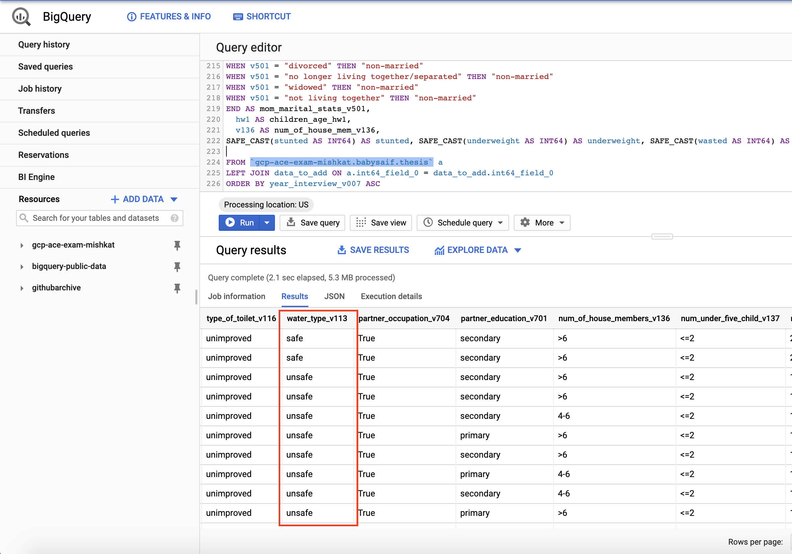

# Preprocessing Categorical Values for Machine Learning using SQL & Python

## 1. The Theories & Intuitions

Anyone working with Machine Learning \(ML\) or Statistical Modeling knows that these models can't directly use categorical values when creating the model. The categorical values needs to be converted to  numerical values for the ML model or stats model to understand. Most ML algorithms like Random Forest, Decision Tree, Support Vector Machine, [XGBoost](https://xgboost.readthedocs.io/en/latest/), [LightGBM](https://lightgbm.readthedocs.io/en/latest/) etc doesn't support categorical value handling out-of-the-box. Only [CatBoost](https://catboost.ai/) and some statistical modeling libraries supports handling of categorical values without the need of preprocessing it. Regardless, every ML practitioner needs to know how to preprocess or handle categorical values for ML models. Mainly how to encode these categories so that our machine can understand.

We have the option to use many popular Python libraries such as Scikit-Learn, SciPy, Pandas etc to preprocess the data. But from experience, I can tell that real world data are messy and aren't as beautiful to work if you've worked with Iris, Titanic data 😂😂. And sometimes, even when you're correct and have done everything right, maybe the library you're using is not handling the categorical values well. Thus, it's better to know multiple ways to handle these problems. Today, I'll show how we can use SQL extensively to handle categorical data and preprocess them so that we can use for creating any ML models.

## TL;DR

### a. Feature Engineering the Categories

When it comes to handling or encoding categorical values, _I stick to two approaches_.

* Use the categories as it is and encode them.
* Reduce down the categories to make them generic and encode them.

#### Use Categories as it is and Encoding Them:

If the number of categorical values are small, then just keep them as it is. For example, if you've a column name 'Animals' and the only unique values it contains are cat, dog, chicken, horse etc, then just leave it as it is and then this can be preprocessed using Label Encoding or One Hot Encoding etc. But when to use which kind of encoding, you may ask? I'll discuss it shortly.

#### Reduce down the categories to make them generic and encode them

This method depends on situation and you need to use your best judgement whether to use this or not because it is highly dependent on the nature of the data as well. Let me give you one scenario. Let's say we have a column with data of various cats, dogs and cows breed. For example, for cats we have Persian, British Short Hair etc, for dogs we have Samoyed, Golden Retriever, Labrador Retriever, Corgi etc and for cows, just image some breed names 😅. First, you need to understand if converting the breeds to a more generic category will penalize the model or not. If not, then make them more generic and reduce the number of categories. It will help with encoding as well. Refer to the below table.

_This is super important especially if you have to do One Hot Encoding \(OHE\) later on to reduce dimensionality._

| Breeds Category | Generic Category |
| :--- | :--- |
| Persian | Cat |
| British Short Hair | Cat |
| Samoyed | Dog |
| Golden Retriever | Dog |
| Corgi | Dog |
| Holstein Friesian | Cow |
| Angus | Cow |

### b. Encoding

The way we convert categorical values to numerical values is called encoding. And there are several encoding methods and ways out there.

If you want to know more about different kinds of encoding, I would exhort you to read this awesome medium blog post titled, "[Smarter Ways to Encode Categorical Data for Machine Learning](https://towardsdatascience.com/smarter-ways-to-encode-categorical-data-for-machine-learning-part-1-of-3-6dca2f71b159)"

But for the sake of this article and keeping it succinct, **I will only stick to** _**Label Encoding**_ **and** _**One Hot Encoding**_**.**

### c. When to use which Encoding?

This is a very important question. A couple of years back, I had the same question. Which Encoding method should I use? What will happen if I use x over y encoding method. So I learned overtime when to use what kind of encoding. For the sake of this article, I'll refer an excellent Q&A from StackExchange.

The answer is not straightforward but can be summarized to something like this \(from [AN6U5](https://datascience.stackexchange.com/a/9447)\):

> LabelEncoder can turn \[dog,cat,dog,mouse,cat\] into \[1,2,1,3,2\], _but then the imposed ordinality means that the average of dog and mouse is cat_. Still there are **algorithms like decision trees and random forests that can work with categorical variables just fine and LabelEncoder can be used to store values using less disk space**.

> _One-Hot-Encoding has the advantage that the result is binary rather than ordinal and that everything sits in an orthogonal vector space_. **The disadvantage is that for high cardinality**, the feature space can really blow up quickly and you start fighting with the curse of dimensionality. In these cases, **I typically employ one-hot-encoding followed by PCA for dimensionality reduction**. I find that the judicious combination of one-hot plus PCA can seldom be beat by other encoding schemes. PCA finds the linear overlap, so will naturally tend to group similar features into the same feature.

[Pushkaraj Joshi](https://datascience.stackexchange.com/a/40908) further added to AN6U5's answer to enrich it.

> While [AN6U5](https://datascience.stackexchange.com/a/9447/29575) has given a very good answer, I wanted to add a few points for future reference. When considering **One Hot Encoding**\(OHE\) and **Label Encoding**, we must try and understand what model you are trying to build. Namely the two categories of model we will be considering are:
>
> 1. **Tree Based Models**: Gradient Boosted Decision Trees and Random Forests.
> 2. **Non-Tree Based Models**: Linear, kNN or Neural Network based.
>
> Let's consider when to apply OHE and when to apply Label Encoding while building tree based models.
>
> We apply OHE when:
>
> 1. When the values that are **close to each other** in the label encoding correspond to target values that aren't close \(non - linear data\).
> 2. When the categorical **feature is not ordinal** \(dog,cat,mouse\).
>
> We apply Label encoding when:
>
> 1. The categorical **feature is ordinal** \(Jr. kg, Sr. kg, Primary school, high school ,etc\).
> 2. When we can come up with a label encoder that **assigns close labels to similar categories**: This leads to less splits in the tress hence reducing the execution time.
> 3. When the number of categorical features in the dataset is huge: One-hot encoding a categorical feature with huge number of values can lead to \(1\) high memory consumption and \(2\) the case when non-categorical features are rarely used by model. You can deal with the 1st case if you employ sparse matrices. The 2nd case can occur if you build a tree using only a subset of features. For example, if you have 9 numeric features and 1 categorical with 100 unique values and you one-hot-encoded that categorical feature, you will get 109 features. If a tree is built with only a subset of features, initial 9 numeric features will rarely be used. In this case, you can increase the parameter controlling size of this subset. In xgboost it is called colsample\_bytree, in sklearn's Random Forest max\_features.
>
> In case you want to continue with OHE, as @AN6U5 suggested, you might want to combine PCA with OHE.
>
> Lets consider when to apply OHE and Label Encoding while building non tree based models.
>
> To apply Label encoding, the dependance between feature and target must be linear in order for Label Encoding to be utilised effectively.
>
> Similarly, in case the dependance is non-linear, you might want to use OHE for the same.

## 2. Preprocessing Using SQL

If you're a data scientist or anyone who works with data, SQL should be one of your best friends. I nowadays generally tend to use SQL more instead of using libraries because sometimes using libraries just doesn't work \(fails to encode, fail to convert dtypes etc\). Thus, knowing more than one way to preprocess is absolutely necessary. Here I'll show 3 different techniques.

1. Reduce down categories using SQL
2. Label Encode
3. One Hot Encode \(OHE\)

Later I'll show how we can do these using Python libraries \(Pandas, Scikit-learn\) or just refer to some awesome sites that had already shown how to do this.

### a. Reduce down categories using SQL

> I would highly recommend using any Cloud based database/datalake/query engine. For my case, I will load my data in Google Cloud Platform \(GCP\)'s BigQuery. BigQuery is Google's managed Data Warehouse. If you don't have access, just use local PostgreSQL/MySQL DB to load the data. BigQuery generally uses standard SQL syntax. So, it should be same whether you use BigQuery or Postgres or MySQL. And I would highly encourage to use any GUI client like [PGAdmin](https://www.pgadmin.org/download/) or [MySQL Workbench](https://www.mysql.com/products/workbench/). Don't be that person who uses archaic and antiquated Oracle Express Community Edition's Console based or any console based approach that most university teaches unless you have to  \(e.g accessing VM/DB instances via SSH\)

I'll show a past example for this one. I had a column in the data where I have multiple categories. Even some had typos as well. The first thing I do is to get the distinct values and their counts. For example,

```text
SELECT col, COUNT(1)
FROM db
GROUP BY 1
```

After getting all the distinct categories, we can reduce it down using CASE statements. Yes, it may seem a bit tedious but trust me it will save a lot of time if Scikit-Learn doesn't work. Below, I'm categorizing if drinking water sources into safe or unsafe.

```text
drinking_water AS (
  SELECT int64_field_0,
  CASE v113
  WHEN "tube well or borehole" THEN "safe"
  WHEN "public tap/standpipe" THEN "safe"
  WHEN "river/dam/lake/ponds/stream/canal/irrigation channel" THEN "unsafe"
  WHEN "piped into dwelling" THEN "safe"
  WHEN "not dejure resident" THEN "unsafe"
  WHEN "not a dejure resident" THEN "unsafe"
  WHEN "rainwater" THEN "safe"
  WHEN "other" THEN "unsafe"
  WHEN "unprotected well" THEN "unsafe"
  WHEN "piped to yard/plot" THEN "safe"
  WHEN "cart with small tank" THEN "safe"
  WHEN "unprotected spring" THEN "unsafe"
  WHEN "protected well" THEN "safe"
  WHEN "protected spring" THEN "safe"
  WHEN "bottled water" THEN "safe"
  WHEN "tanker truck" THEN "safe"
  END AS water_type_v113
  FROM `gcp-ace-exam-mishkat.babysaif.thesis` 
)

SELECT drinking_water.* EXCEPT(int64_field_0), a.* EXCEPT(v113)
FROM `gcp-ace-exam-mishkat.babysaif.thesis` a
LEFT JOIN drinking_water ON a.int64_field_0 = drinking_water.int64_field_0
```

Here `v113` was the column name and the row values are now either safe or unsafe according to logic. Then it's just a matter of joining the table `drinking_water` with the original table and then creating the new table. The result should look like this:



### b. Label Encoding

Now if we just want to do label encoding on the above data, we can just use CASE statement again. I'll encode safe as 0 and unsafe as 1. You can just use a sub-query in the previous SQL as well. For the sake of simplicity, I split it. The SQL should now look something like this:

```text
drinking_water AS (
  SELECT int64_field_0,
  CASE water_type_v113
  WHEN "safe" THEN "0"
  WHEN "unsafe" THEN "1"
  END AS water_type_v113
  FROM `gcp-ace-exam-mishkat.babysaif.thesis` 
)
```

Then just join it back with the original data.

### c. One Hot Encoding

For this case, I had a column name continent and it had total 5 values. I created a separate column for each categorical values and binarize it to 0 and 1 using the CASE statement as well. If the value exists in that row, then put 1, if not then put 0. Super easy but very handy. When Scikit-Learn's OHE fails, this will be just pure life saver. After OHE has been done, all you need is to add this table back to the original table using LEFT JOIN.

```text
user_location AS (
  SELECT
    clientid,
    CASE
      WHEN REGEXP_CONTAINS(continent, r"asia") THEN 1 ELSE 0
    END AS continent_asia,
    CASE
      WHEN REGEXP_CONTAINS(continent, r'africa') THEN 1 ELSE 0
    END AS continent_africa,
    CASE
      WHEN REGEXP_CONTAINS(continent, r'americas') THEN 1 ELSE 0
    END AS continent_america,
    CASE
      WHEN REGEXP_CONTAINS(continent, r"oceania") THEN 1 ELSE 0
    END AS continent_oceania,
    CASE
      WHEN REGEXP_CONTAINS(continent, r"(not set)") THEN 1 ELSE 0
    END AS continent_other
  FROM db
  )
```

So this is the end for preprocessing using SQL. I have just put the basic one here. There are more advanced stuffs that can be done so easily using SQL instead of coding it through.

## 3. Preprocessing using Python & Scikit-Learn

Since there are so many widely available tutorials available on how to encode using Scikit-Learn or Python, I'll just put some of the best references here.

1. [Feature Encoding Techniques – Machine Learning](https://www.geeksforgeeks.org/feature-encoding-techniques-machine-learning/)
2.  [Smarter Ways to Encode Categorical Data for Machine Learning](https://towardsdatascience.com/smarter-ways-to-encode-categorical-data-for-machine-learning-part-1-of-3-6dca2f71b159)
3. [Here’s All you Need to Know About Encoding Categorical Data \(with Python code\)](https://www.analyticsvidhya.com/blog/2020/08/types-of-categorical-data-encoding/)

Hope you enjoyed the reading. Happy learning! 😃😃

