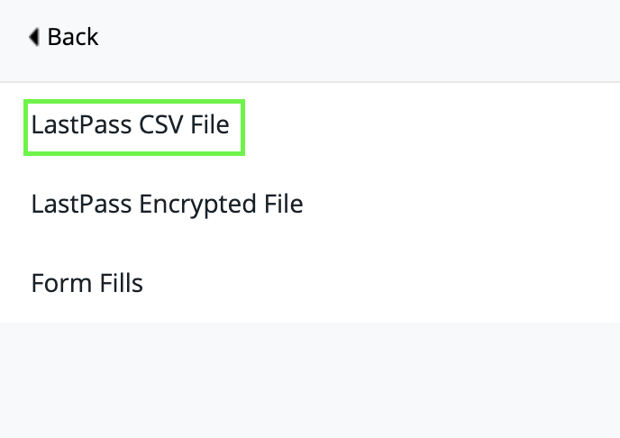
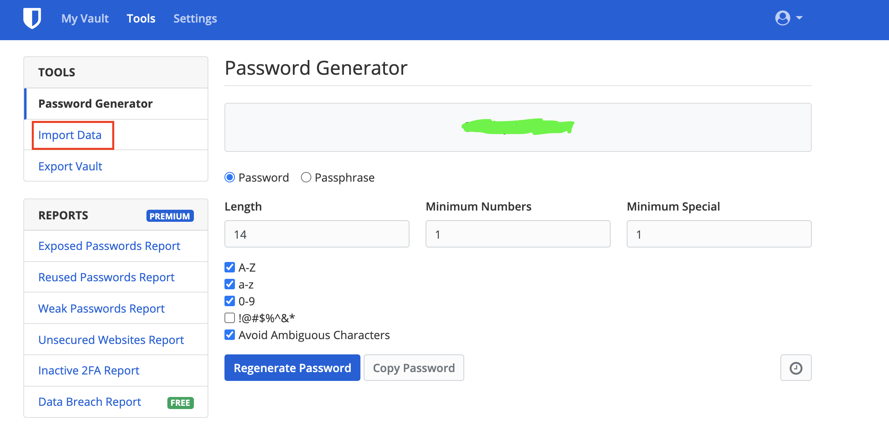
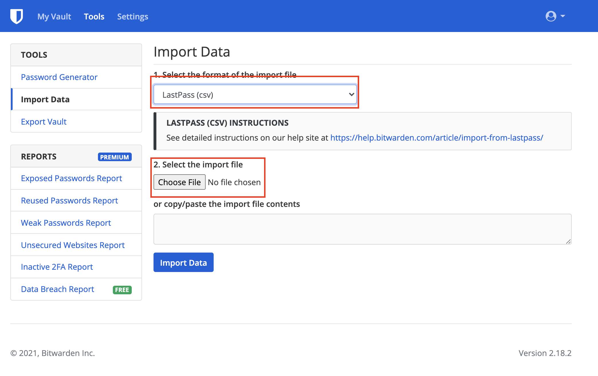

# Moving from LastPass to Bitwarden

Recently LastPass has [announced](https://blog.lastpass.com/2021/02/changes-to-lastpass-free/) some policy changes and the most important one was that Free tier users are going to be locked to use only one type of device \(either Computer or Mobile\). To use LastPass in all types of devices, you've to shell out some money from your wallet to get LastPass Premium, which is about 3$/month. And existing users will get a 25% off \(2.25$/month\) if they opt for the premium package.

## Moving to Bitwarden

[Bitwarden](https://bitwarden.com/) is a great alternative to LastPass. It's open-source. Meaning it's very secure. Plus it has multiple security features like 2FA, and HW based authenticator such as YubiKey etc. And unlike LastPass, it doesn't restrict users from using different kinds of devices from accessing the vault. And also the Premium version is cheap \(10$/year\). I was using Bitwarden before but LastPass was still my go to password manager. Since the recent announcement, I have decided to shift from LastPass to Bitwarden. Bitwarden has browser extensions, web vault access along with mobile apps for all the popular platforms \(Android, iOS\).

## Migrating from LastPass to Bitwarden

It's quite easy to migrate your existing data from LastPass to Bitwarden. Here's my step by step easy guide.

1. From LastPass browser plugin, click on **Account Options**. Then navigate to **Advanced**.
2. Then go to **Export** and then click on **LastPass CSV File.**

3. Then download the CSV file in your local machine.

4. Next, login to your Bitwarden Vault. Go to **Tools**. And click on the **Import Data** tab.

5. Select the import data format to **LastPass \(csv\)** from the dropdown menu.

6. Select the previously downloaded LastPass CSV file and then click on the **Import Data** button. 

And your LastPass data will be migrated to Bitwarden shortly!

#### AND WE ARE DONE!

## CAUTION!

> ### REMEMBER TO DELETE THE DOWNLOADED CSV FILE FROM LOCAL COMPUTER PERMANENTLY

